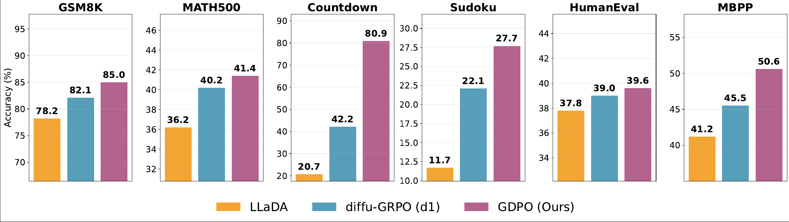

<div align="center">
  <h1>GDPO: Group Diffusion Policy Optimization</h1>
  <p>
<<<<<<< HEAD
    A novel policy gradient reinforcement learning algorithm to extend GRPO to discrete diffusion. We feature efficient <strong>sequence level</strong> log probability estimation as well as training code for GDPO in standard reasoning and coding benchmarks.
=======
    A novel policy gradient reinforcement learning algorithm to extend GRPO to discrete diffusion. We feature efficient ** sequence level ** log probability estimation as well as training code for GDPO in standard reasoning and coding benchmarks.
>>>>>>> 94f9aa3 (GDPO Files)
  </p>
</div>

<div align="center">
  <hr width="100%">
</div>



<div align="center">
  <hr width="100%">
</div>

## Overview

This repository implements **GDPO (Group Diffusion Policy Optimization)**, to scale reasoning in diffusion large language models. Our codebase is built on top of the D1 repository.

## Quick Start

### Environment Setup

We use `uv` to set up our environment, alternatively if you prefer using conda you can use the same environment as d1. You can run this through:

```bash
uv sync
```

### Training

For training, you can submit a job via `sbatch` using `gdpo/slurm_scripts/countdown_base.sbatch`. Modify the contents of the file to adjust hyperparameters as needed.

### Evaluation

For evaluation, you can use the `eval.py` script. A sample usage is:

```bash
cd eval/
uv run torchrun --nproc_per_node=1 eval.py \
  --dataset math \
  --gen_length 256 \
  --output_dir sample-generations 
  --model_path GSAI-ML/LLada-8B-Instruct \ 
  --checkpoint_path path-to-lora-adapter
```
If evaluating the base model do not pass the `--checkpoint_path` flag. To compute accuracy, modify line 511 of `eval/parse_and_get_acc.py` with the directory used above and run:

```bash
python3 parse_and_get_acc.py
```

This will print the results for all evaluated checkpoints.

## GDPO

The reinforcement learning code is located in the `gdpo` directory.

- `gdpo/slurm_scripts/` contains a sample SLURM script used to run the RL experiments
- `gdpo/likelihood_estimators.py` contains the likelihood estimators implemented in our paper. Implement your own and train using GDPO!

## Citation

If you find this work useful, please consider citing.

```bibtex
@article{rojas2025improving,
  title={Improving Reasoning for Diffusion Language Models via Group Diffusion Policy Optimization},
  author={Rojas, Kevin and Lin, Jiahe and Rasul, Kashif and Schneider, Anderson and Nevmyvaka, Yuriy and Tao, Molei and Deng, Wei},
  journal={arXiv preprint arXiv:2510.08554},
  year={2025}
}
```

## Acknowledgments

This work is built on top of the [D1 repository](https://github.com/ML-GSAI/d1) by Zhao et al. (2025). We gratefully acknowledge the original authors for their pioneering work on scaling reasoning in diffusion large language models via reinforcement learning. 

## License

Please refer to the LICENSE file for details on the license terms.
